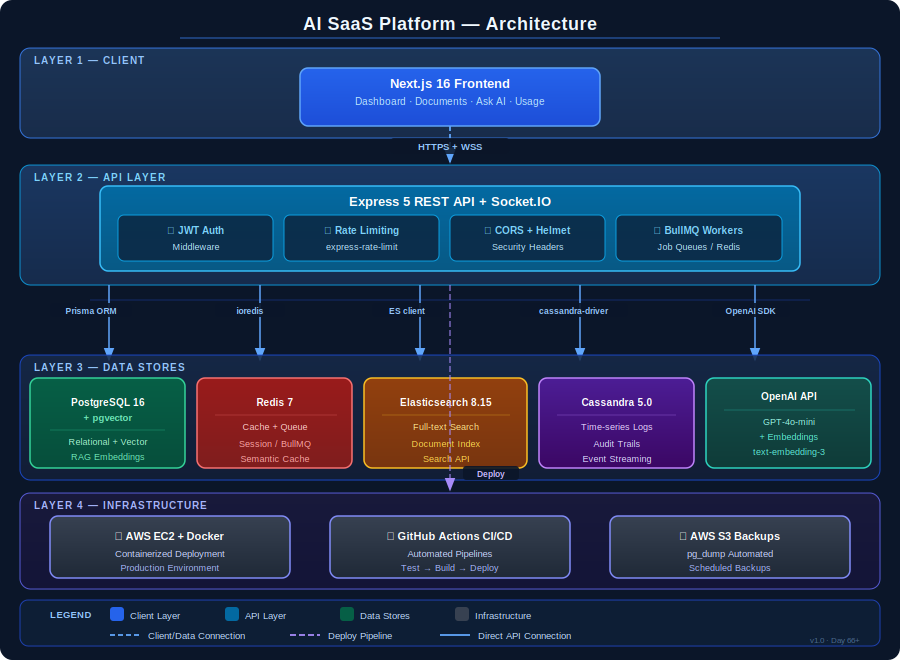

# Node.js AI SaaS Backend

A production-grade REST API backend for an AI-powered SaaS platform, built independently as part of a structured learning journey toward becoming an AI-integrated backend architect. Demonstrates real-world backend engineering skills — from secure JWT authentication and Redis-backed session management to OpenAI integration with cost tracking, vector embeddings, and Retrieval-Augmented Generation (RAG) — alongside multi-tenant organisations, plan-based billing, webhook delivery, full-text search, real-time WebSockets, push notifications, async job processing, and time-series logging across five databases.

> **Note:** This is a portfolio/learning project. The private repository contains the full source code. This public repository contains documentation only.

---

## What Problem It Solves

Most AI SaaS systems stop at "call the OpenAI API and return the result." This project goes further by solving the production concerns that actually matter:

- **Who can call the AI?** — Full JWT auth with refresh token rotation and Redis-based token invalidation
- **How much does it cost per user?** — Per-request token and USD cost tracking stored in PostgreSQL
- **How do you search large documents intelligently?** — pgvector-powered semantic search with overlapping text chunks and cosine similarity scoring
- **How do you answer questions grounded in user documents?** — A full RAG pipeline: embed → store → retrieve → prompt → respond
- **How do you prevent redundant AI calls?** — Semantic caching: embed each question and skip OpenAI entirely when a semantically equivalent question was answered recently
- **How do you prevent abuse?** — Redis-backed rate limiting at both global and auth-specific levels, plus plan-tier request/token/document limits enforced per user
- **How do you offload slow work?** — BullMQ background queues for email and document processing jobs
- **How do callers know when background jobs finish?** — DB-persisted job events table with a polling endpoint and optional HTTP webhook delivery on completion
- **How do you serve multiple teams from one deployment?** — Multi-tenant organisation model: users belong to an org, all data is org-scoped, and org admins can invite members
- **How do you monetise tiered access?** — Free / Pro / Enterprise plan system with per-plan request, token, and document limits; simulated billing events with a Stripe integration pathway
- **Is the system healthy right now?** — Deep health checks for PostgreSQL, Redis, and memory; a metrics endpoint; and a performance endpoint tracking slow requests and top endpoints

---

## What This Project Demonstrates

- **AI Integration** — RAG pipeline with source attribution, semantic caching, vector embeddings via OpenAI
- **Multi-database Architecture** — PostgreSQL, pgvector, Redis, Elasticsearch, and Cassandra each used for their optimal use case
- **Real-time Events** — Socket.IO with JWT authentication and private user rooms
- **Push Notifications** — Firebase FCM with native service worker (cross-browser)
- **Production Patterns** — Multi-stage Docker builds, GitHub Actions CI/CD, AWS EC2, S3 backups, health monitoring
- **Security** — JWT with refresh token rotation, Redis-based token invalidation, helmet, CORS, rate limiting, input sanitization
- **Multi-tenancy** — Soft org isolation with org_id across all data tables
- **Async Processing** — BullMQ job queue with webhook callbacks

---

## Tech Stack

| Layer | Technology | Purpose |
|---|---|---|
| Runtime | Node.js 20 LTS | Server runtime |
| Framework | Express 5 | HTTP server |
| ORM | Prisma 6 | Database access |
| Primary DB | PostgreSQL 16 | Relational data |
| Vector Search | pgvector | Semantic similarity search |
| Cache / Queue | Redis 7 + BullMQ | Caching, rate limiting, job queue |
| Full-text Search | Elasticsearch 8.15 | Keyword search with fuzzy matching |
| Time-series | Cassandra 5.0 | Login logs, page visit logs |
| AI | OpenAI SDK v6 | GPT-4o-mini, text-embedding-3-small |
| Real-time | Socket.IO | WebSocket events |
| Push | Firebase Admin SDK v14 | FCM push notifications |
| Auth | JWT + bcrypt | Authentication |
| Containerisation | Docker + Compose | Local and production deployment |
| CI/CD | GitHub Actions | Automated deployment |
| Cloud | AWS EC2 + S3 | Hosting and backups |

---

## Architecture

## Architecture Diagram



---

### System Overview

```
┌─────────────────────────────────────────────────────────┐
│                     CLIENT LAYER                        │
│          Next.js 16 (React, Tailwind CSS)               │
│    Login │ Dashboard │ Documents │ Ask AI │ Usage       │
└──────────────────────┬──────────────────────────────────┘
                       │ HTTPS + WSS
┌──────────────────────▼──────────────────────────────────┐
│                  REVERSE PROXY                          │
│                 Nginx + SSL                             │
└──────────────────────┬──────────────────────────────────┘
                       │
┌──────────────────────▼──────────────────────────────────┐
│              API LAYER (Express 5 + Socket.IO)          │
│                                                         │
│  /api/v1/auth        /api/v1/documents   /api/v1/rag   │
│  /api/v1/users       /api/v1/search      /api/v1/billing│
│  /api/v1/ai          /api/v1/jobs        /api/v1/orgs  │
│  /api/v1/activity    /api/v1/documents-search           │
│                                                         │
│  Middleware: authenticate → attachOrg → authorize       │
│  Security: helmet, CORS, HPP, sanitization, rate limit  │
└──────┬──────────┬────────────┬───────────┬─────────────┘
       │          │            │           │
┌──────▼───┐ ┌───▼────┐ ┌────▼────┐ ┌───▼────────┐
│PostgreSQL│ │ Redis  │ │Elastic  │ │ Cassandra  │
│+pgvector │ │+BullMQ │ │ search  │ │            │
│          │ │        │ │         │ │ login_logs │
│users     │ │cache   │ │documents│ │ page_visits│
│documents │ │jobs    │ │ index   │ │            │
│embeddings│ │rate    │ │         │ └────────────┘
│rag_history│ │limits  │ └─────────┘
│billing   │ └────────┘      │
└──────────┘           ┌─────▼──────────┐
       │               │  OpenAI API    │
       │               │  GPT-4o-mini   │
┌──────▼──────────┐    │  Embeddings    │
│  BullMQ Workers │    └────────────────┘
│  EmbeddingWorker│         │
│  → Socket.IO    │◄────────┘
│  → FCM notify   │
│  → Webhook      │
└─────────────────┘
```

### Why Five Databases?

Each database is chosen for a specific access pattern:

| Database | Use Case | Why Not PostgreSQL? |
|---|---|---|
| PostgreSQL | Relational/transactional data | Primary store |
| pgvector | Vector similarity search | Native vector ops in same DB |
| Redis | Sub-millisecond caching, job queues | Speed, pub/sub |
| Elasticsearch | Full-text keyword search | Fuzzy matching, highlighting, relevance scoring |
| Cassandra | High-volume append-only time-series | Partition-key design, write throughput |

---

## RAG Pipeline

```
User question
  → Check semantic cache (cosine similarity, threshold 0.92)
  → Cache hit → return cached answer
  → Check exact cache (MD5 hash)
  → Cache hit → return cached answer
  → Generate question embedding (text-embedding-3-small)
  → Vector similarity search (pgvector, threshold 0.6)
  → Retrieve top N chunks (min 2 required)
  → Build prompt with source attribution rules
  → Call GPT-4o-mini (temperature 0.1)
  → Calculate confidence (70% top chunk + 30% average)
  → Cache result (30 min TTL)
  → Save to rag_history
  → Return answer + sources + confidence
```

---

## API Endpoints

### Auth
| Method | Endpoint | Description |
|---|---|---|
| POST | `/api/v1/auth/register` | Register new user |
| POST | `/api/v1/auth/login` | Login, receive tokens |
| POST | `/api/v1/auth/refresh` | Refresh access token |
| POST | `/api/v1/auth/logout` | Logout, revoke token |

### Documents
| Method | Endpoint | Description |
|---|---|---|
| GET | `/api/v1/documents` | List documents |
| POST | `/api/v1/documents` | Create document |
| DELETE | `/api/v1/documents/:id` | Delete document |
| POST | `/api/v1/documents/:id/embed` | Queue embedding job |
| GET | `/api/v1/documents/:id/embed/status` | Embedding status |

### Search
| Method | Endpoint | Description |
|---|---|---|
| POST | `/api/v1/search` | Semantic search (pgvector) |
| GET | `/api/v1/documents-search` | Full-text search (Elasticsearch) |

### RAG
| Method | Endpoint | Description |
|---|---|---|
| POST | `/api/v1/rag/ask` | Ask a question |
| GET | `/api/v1/rag/history` | Query history |

### Billing & Usage
| Method | Endpoint | Description |
|---|---|---|
| GET | `/api/v1/billing/plans` | Available plans |
| POST | `/api/v1/billing/upgrade` | Upgrade plan |
| GET | `/api/v1/users/usage` | Usage stats |
| GET | `/api/v1/activity/logins` | Login history (Cassandra) |
| GET | `/api/v1/activity/visits` | Page visit history (Cassandra) |

### Health
| Method | Endpoint | Description |
|---|---|---|
| GET | `/health/ping` | Lightweight ping |
| GET | `/health` | Deep health check |
| GET | `/health/metrics` | Request counts, p95/p99 |

---

## Key Architecture Decisions

### ADR 001 — PostgreSQL in Docker vs AWS RDS
Chose Docker on EC2 for cost (free vs ~$30/month) and full control. pgvector pre-installed. Migration path to RDS when paying customers exist.

### ADR 002 — Custom Migration Runner vs Prisma Migrate
Custom SQL runner with transaction-wrapped rollback, automatic startup execution, and duration tracking. Trade-off: no schema diffing.

### ADR 003 — Soft Multi-Tenancy vs Hard Isolation
Single database with org_id on all tables. Sufficient for early-stage SaaS. Migration path to schema-per-tenant for compliance requirements.

### ADR 004 — In-Memory Metrics vs External APM
Custom metrics store — zero cost, zero dependencies. Migration path to Prometheus + Grafana when scaling beyond one instance.

### ADR 005 — Semantic Caching
Per-user question vector index in Redis. Cosine similarity threshold 0.92 catches paraphrased questions. Capped at 100 vectors per user, 30 min TTL.

---

## Project Versions

| Tag | Description |
|---|---|
| `v1.0-production` | Phase 3 — backend hardening, security, monitoring, load testing |
| `v2.0` | Phase 4 — RAG improvements, frontend, FCM, Elasticsearch, WebSockets, Cassandra |

---

## Related Repository

Frontend: [node-ai-saas-frontend](https://github.com/kashifumar/node-ai-saas-frontend)

---

## Author

**KASHIF UMAR**

[LinkedIn](https://www.linkedin.com/in/kashif-umar/) · [X](https://x.com/kashif_umar)

© 2025 All rights reserved. Unauthorized reproduction is not permitted.

---
